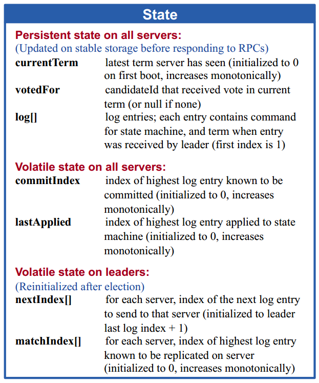
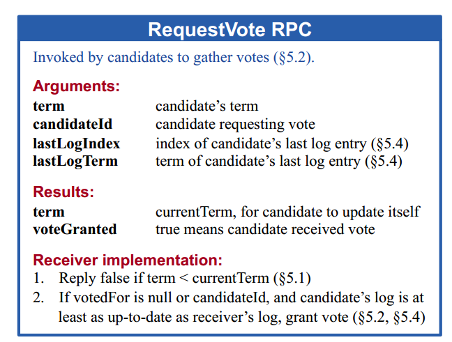
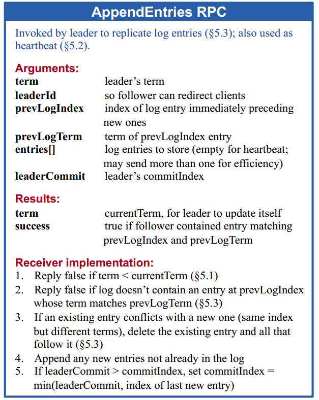
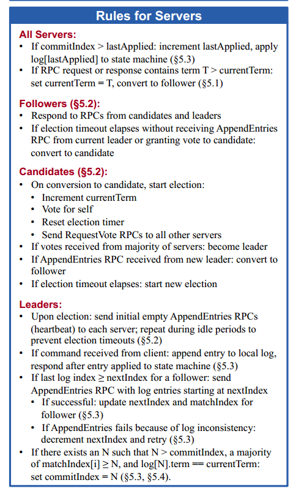
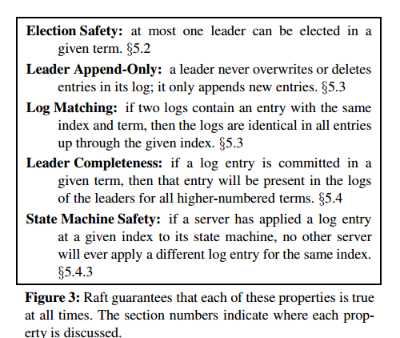

## 1 Intro

Consensus algorithms allow a collections to work as a coherent group that can survive the failures of some of its members.

Paxos is quit difficult to understand.

为了理解性(understandability), 设计出了 Raft 一致性算法。

## 2 Replicated state machines

Replicated state machines: A collection of several computers with the same states ?

Each change is added as an entry in the node's log. 

This log entry is currently uncommitted so it won't update the node's value. 

To commit the entry the node first replicates it to the follower nodes... 

then the leader waits until a majority of nodes have written the entry. 

The entry is now committed on the leader node and the node state is "5".

The leader then notifies the followers that the entry is committed.

The cluster has now come to consensus about the system state.

## 5

#### Leader election

term, election, 每个 term 都是以选举开始。

注意的点：

在成为 candidate 的时候会增加 term，然后 vote 自己一票，在 issues RequestVote。

结果：

如果收到大多数的 vote，那么他就成为 leader。

candidate 们在选举的时候，如果同时没有谁获得 majority 的 vote，那么会进行下一轮的 election。也意味着增加 trerm。

candidate 在等待 vote 的时候，如果接收到了 AppendEntries，判断他的 term 是否比自己高或者一样：1) 如果是，那么意味着新的 leader 已经选举出来，自己则退回 follower。 2）如果不是，那么久 rejects the RPC and continues in candidate state.

#### Log replication

> If follower crash or run slowly, or if network packets are lost, the leader retries AppendEntries RPCs indefinitely until all store all log entries.

如果 follower 崩溃你或者收到网络的影响变慢， leader 会一直无限的去重新尝试 AppendEntries RPCs 直到全部保存了 log entries.

Log entry 包含一个 term number 用来检测 log 之间的不一致。并且每个 Log 都有一个 integer index 来索引。

>  A log entry is committed once the leader that created the entry **has replicated it on a majority of the servers** (e.g., entry 7 in Figure 6).

**Committed**: 一个由 leader 创建的 log entry 如果被大多数 servers 复制(replicated)，那么就是 **committed**, 并且一旦 log entry 被 committed, 他就会被 local state machine 执行 (applied).

当 leader 发起 ApeendEntries RPC 的时候，follower 中没有找到具有相同 index 和 term 的 log entry 的时候，就会拒绝这次收到的新的 entries。然后 consistency check 就会工作。

通常情况下的操作不会引起 AppendEntries consistency check 失败。但是当 leader 崩溃的时候就会导致 log 不一致(inconsistent)。

在 Raft 中，leader 处理不一致的方法是通过强制 follower 的 log 来拷贝自己。但是会有一些限制(restriction)。

Leader 会找到 follower 的最近的两个相同的 log entry (the latest log entry where the two logs agree), 删除掉 follower 的这个 log entry 之后的 entries, 在发送 leader 自己的在这个点之后(after that point)的所有的 log entries 给它。这些行为发生在 AppendEntries 的 consistency check. Leader 为**每一个**的 follower 维护一个 nextIndex, which is the index of next log entry the leader will send to that follower. 当一个新的 leader 掌权后， nextIndex 就会被更新为它的最后一位的 log entry 的 index 的后一位。

如果 leader 的 AppendEntries 失败，那么就会 --nextIndex，然后在 AppendEntries, 直到与 follower 一致。然后 remove 冲突的 entries 及其以后，在 appends entries from the leader's log. 制药 AppendEntries 成功， follower 的 log 就会与 leader 的达成一致。

Leader never overrites or deletes entries in its own log.

A single slow follower will not impact performance.

#### 5.4 Safety

1

一个假设：如果一个 follower 变成了 unavailable 状态，然后没有发生 committed, 并且在之后，又重新成为了 leader, 那么就会导致在它沦为 unavailable 状态时，当时 leader 的 committed 的数据的丢失，这是不能够接受的。

Raft 添加为选举成为 leader 添加了一个限制。这个限制确定了 leader 在任何 term 都会包含前一个 term 的所有 committed entries(the Leader Completeness Property from Figure 3). 

Raft 使用 voting 来避免 candidate 成为 leader 除非他的 log 包含所有 committed entries. 一个 candidate 必须要与集群中的大多数联系来让他被选举，这也就意味着每个 committed entry 必然(must be)存在于这些 servers 中的至少其中一个(原句：which means that every committed entry must be present in at least one of those servers)。

RequestVote RPC 的限制：这个 RPC 包含 candidate 的 log 信息，并且 voter(那些收到这个 RPC 的 follower 或者 server) 在他们自己如果更加 up-to-date 的情况下选择否定。

up-to-date 的判断，也就是比较是否 candidate 比 voter 更加 up-to-date 的方法：通过比较两个 log 的最后(last)**不同的** entries，如果哪一个 log 的最新(later)，那么他就 more up-to-date。如果相同，那么就比较谁的 log 更长，谁就 up-to-date.

2

> Raft never commits log entries from previous terms by counting replicas. Only log entries from the leader's **current term** are committed by counting replicas.

Raft 只会 commits 当前 term 的 log entries, 不会管前一个 term 的。避免了论文中 Figure 8 的问题。

## Further

Seciton 6 之后目前用不到，有时间再看吧。